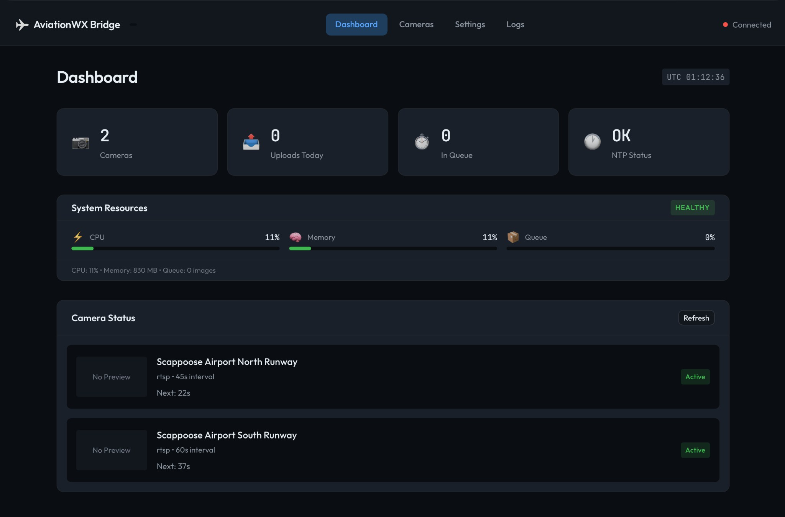
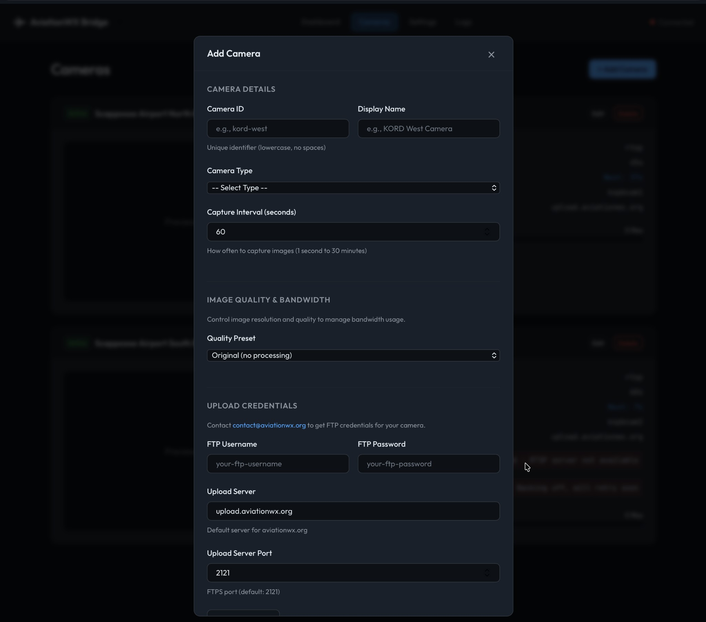

# AviationWX Bridge

Remote bridge device for capturing webcam snapshots and uploading them to AviationWX.org. Designed for Raspberry Pi Zero 2 W and other embedded devices.

## Overview

AviationWX Bridge is a lightweight daemon that:
- Captures webcam snapshots from local network cameras (HTTP, ONVIF, RTSP)
- Queues images locally with accurate observation timestamps
- Uploads to `upload.aviationwx.org` via SFTP (recommended) or FTPS
- Uses tmpfs (RAM) for image buffering to avoid SD card wear
- Provides a modern web console for configuration and monitoring

**Perfect for**: Airport operators wanting to provide webcam feeds to pilots for weather assessment and flight safety.

| Dashboard | Camera Configuration |
|:---------:|:--------------------:|
|  |  |

---

## Installation

Choose the path that matches your environment:

### Path A: Raspberry Pi (Set and Forget)

**Best for:** Dedicated devices at remote locations with minimal IT support.

One command installs everything:

```bash
curl -fsSL https://raw.githubusercontent.com/alexwitherspoon/aviationwx-bridge/main/scripts/install.sh | sudo bash
```

**This script will:**
1. Install Docker (if not already installed)
2. Install a lightweight update supervisor
3. Pull and start the AviationWX Bridge container
4. Configure automatic security updates
5. Set up automatic restart on boot

**After installation:**
- Web console: `http://<your-device-ip>:1229`
- Default password: `aviationwx` (change this immediately!)
- Updates are checked every 6 hours
- Critical security updates apply automatically

---

### Path B: Docker (IT-Managed)

**Best for:** Professional environments with existing Docker infrastructure and IT teams.

```bash
docker pull ghcr.io/alexwitherspoon/aviationwx-bridge:latest

docker run -d \
  --name aviationwx-bridge \
  --restart=unless-stopped \
  -p 1229:1229 \
  -v /opt/aviationwx/data:/data \
  --tmpfs /dev/shm:size=200m \
  ghcr.io/alexwitherspoon/aviationwx-bridge:latest
```

**Docker Compose:**

```yaml
services:
  aviationwx-bridge:
    image: ghcr.io/alexwitherspoon/aviationwx-bridge:latest
    container_name: aviationwx-bridge
    restart: unless-stopped
    ports:
      - "1229:1229"
    volumes:
      - ./data:/data
    tmpfs:
      - /dev/shm:size=200m  # Adjust based on camera count/resolution
```

**Your responsibility:**
- Manage updates via your existing tooling (Portainer, Watchtower, Kubernetes, etc.)
- Monitor container health
- Handle rollbacks if needed

**We provide:**
- Semantic versioned Docker images (`:latest`, `:1.0.0`, `:1.0`)
- Health endpoint at `/healthz`
- Changelog with breaking changes clearly marked

---

## Updates

### Raspberry Pi (Path A)

Updates are handled automatically by the supervisor:

| Update Type | Behavior |
|-------------|----------|
| **Normal** | Notification shown in web UI; user can apply when convenient |
| **Critical** | Auto-applies after 24-hour grace period |
| **Emergency** | Applies immediately (rare, security issues only) |

All updates include automatic rollback if health checks fail.

**Manual update:**
```bash
sudo systemctl start aviationwx-supervisor
```

**Check update status:**
```bash
cat /data/aviationwx/update-available.json
```

### Docker (Path B)

Update using your preferred method:

```bash
docker pull ghcr.io/alexwitherspoon/aviationwx-bridge:latest
docker stop aviationwx-bridge
docker rm aviationwx-bridge
docker run -d ... # (same run command as before)
```

---

## Configuration

Access the web console at `http://<device-ip>:1229/` to configure:

- Camera sources (URL, authentication)
- Capture intervals (1 second to 30 minutes)
- Local timezone (for EXIF interpretation)
- Image processing (resize, quality)
- Queue management settings

### FTP Credentials

Contact [contact@aviationwx.org](mailto:contact@aviationwx.org) to obtain upload credentials.

### Example Config

```json
{
  "version": 2,
  "timezone": "America/Chicago",
  "cameras": [
    {
      "id": "kord-west",
      "name": "KORD West Runway",
      "type": "http",
      "enabled": true,
      "snapshot_url": "http://192.168.1.100/snapshot.jpg",
      "capture_interval_seconds": 60,
      "upload": {
        "protocol": "sftp",
        "host": "upload.aviationwx.org",
        "port": 2222,
        "username": "your-username",
        "password": "your-password"
      }
    }
  ]
}
```

---

## Features

- **Multiple Camera Types**: HTTP snapshot, ONVIF, RTSP (via ffmpeg)
- **Historic Replay**: Queue images for time-series display on aviationwx.org
- **Accurate Timestamps**: UTC observation times with EXIF validation (via exiftool)
- **Web Console**: Modern dashboard with camera preview and management
- **Secure Upload**: SFTP (recommended) or FTPS with fail2ban-aware retry logic
- **Low Memory**: Optimized for Raspberry Pi Zero 2 W (512MB RAM)
- **NTP Health**: Automatic time validation and drift detection
- **Auto Updates**: Critical security updates with automatic rollback (Path A)
- **Hot-Reload**: Camera, timezone, and SNTP config changes apply instantly (no restart)

---

## Architecture

```
┌─────────────────────────────────────────────────────────────┐
│                     AviationWX Bridge                       │
├─────────────────────────────────────────────────────────────┤
│  ┌─────────────┐  ┌─────────────┐  ┌─────────────────────┐  │
│  │   Camera    │  │   Camera    │  │    Web Console      │  │
│  │   Worker    │  │   Worker    │  │    (port 1229)      │  │
│  └──────┬──────┘  └──────┬──────┘  └─────────────────────┘  │
│         │                │                                   │
│         ▼                ▼                                   │
│  ┌─────────────────────────────────────────────────────────┐ │
│  │              File Queue (tmpfs /dev/shm)                │ │
│  │   ├── camera-1/                                         │ │
│  │   │   ├── 20231225T143022Z.jpg                          │ │
│  │   │   └── 20231225T143122Z.jpg                          │ │
│  │   └── camera-2/                                         │ │
│  │       └── 20231225T143052Z.jpg                          │ │
│  └─────────────────────────────────────────────────────────┘ │
│         │                                                    │
│         ▼                                                    │
│  ┌─────────────────────────────────────────────────────────┐ │
│  │              Upload Worker (round-robin)                │ │
│  │   → SFTP/FTPS to upload.aviationwx.org                  │ │
│  └─────────────────────────────────────────────────────────┘ │
└─────────────────────────────────────────────────────────────┘
```

---

## Hardware Requirements

**Minimum (Raspberry Pi Zero 2 W):**
- 512MB RAM
- 8GB SD card
- Network access to cameras and internet

**Recommended:**
- Raspberry Pi 4 (2GB+ RAM)
- 16GB+ SD card
- Wired ethernet for reliability

---

## Security

- Container runs as non-root user
- Minimal Linux capabilities
- FTPS TLS enabled by default
- Web console protected by password authentication
- Read-only filesystem (only `/data` writable)
- Automatic security updates (Path A)

---

## Troubleshooting

### View logs
```bash
# Container logs
docker logs aviationwx-bridge

# Supervisor logs (Path A only)
cat /data/aviationwx/supervisor.log
```

### Restart the bridge
```bash
docker restart aviationwx-bridge
```

### Force rollback (Path A only)
```bash
sudo /usr/local/bin/aviationwx-supervisor rollback
```

### Complete reinstall
```bash
docker stop aviationwx-bridge
docker rm aviationwx-bridge
# Re-run installation command
```

---

## Documentation

- **[Local Development](docs/LOCAL_SETUP.md)** - Development environment setup
- **[Deployment Guide](docs/DEPLOYMENT.md)** - Production deployment details
- **[Queue & Memory Management](docs/QUEUE_STORAGE.md)** - How storage and memory are managed
- **[Config Reference](docs/CONFIG_SCHEMA.md)** - Full configuration options
- **[Changelog](CHANGELOG.md)** - Version history

---

## Contributing

See [CONTRIBUTING.md](CONTRIBUTING.md) for guidelines.

## License

MIT License - See [LICENSE](LICENSE)

---

**Made for pilots, by pilots** ✈️

Contact: [contact@aviationwx.org](mailto:contact@aviationwx.org)
